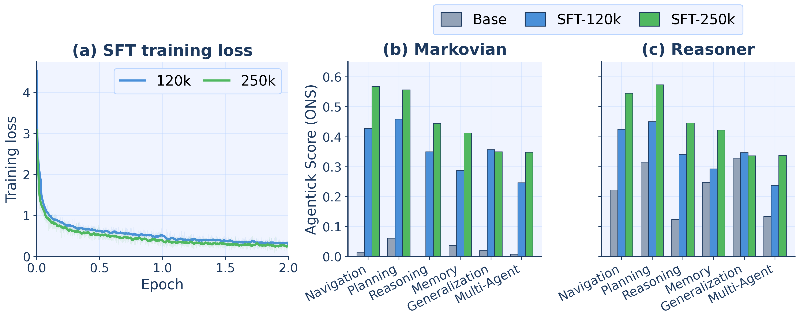
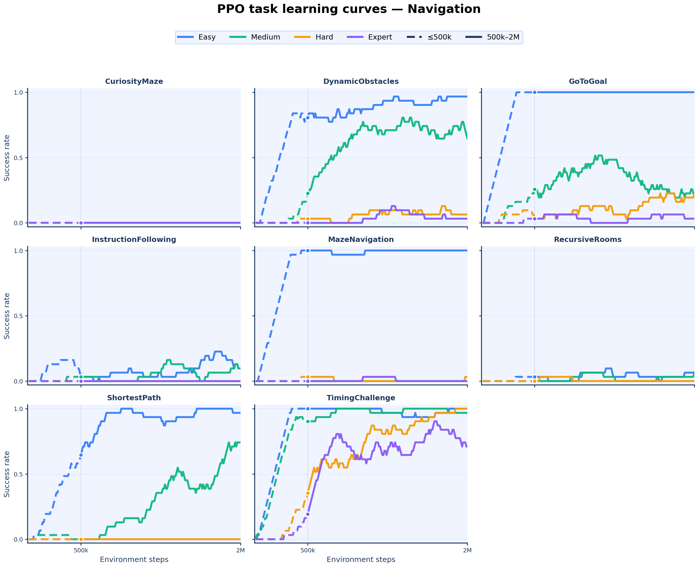
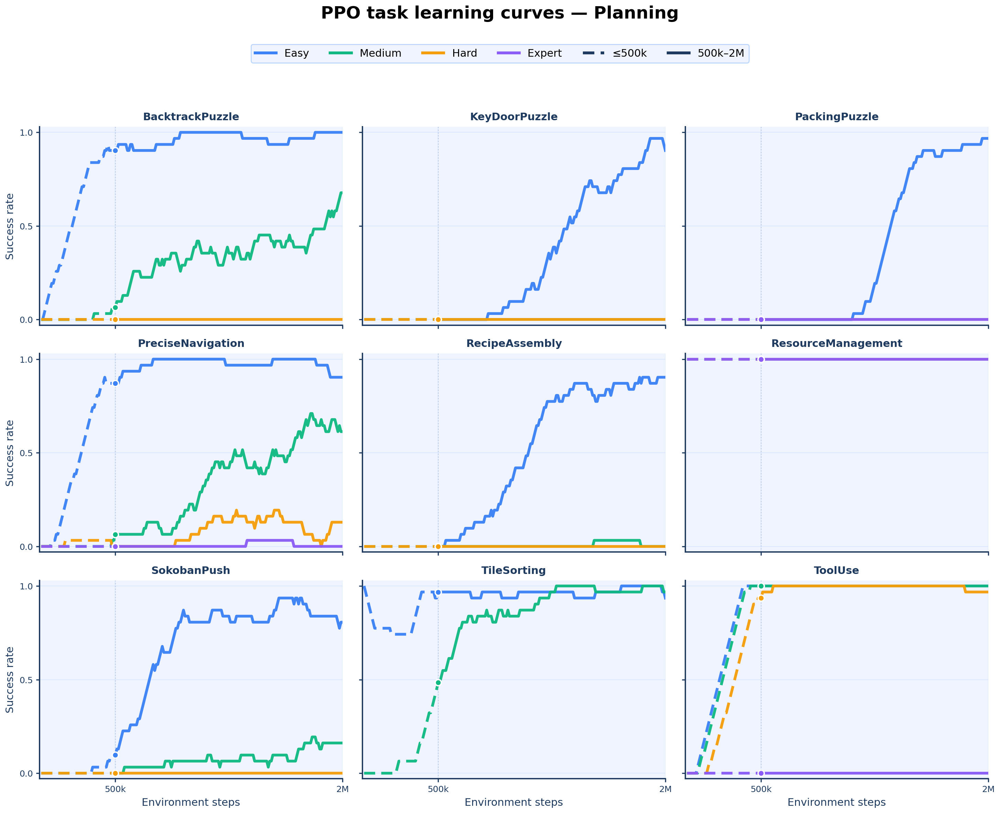
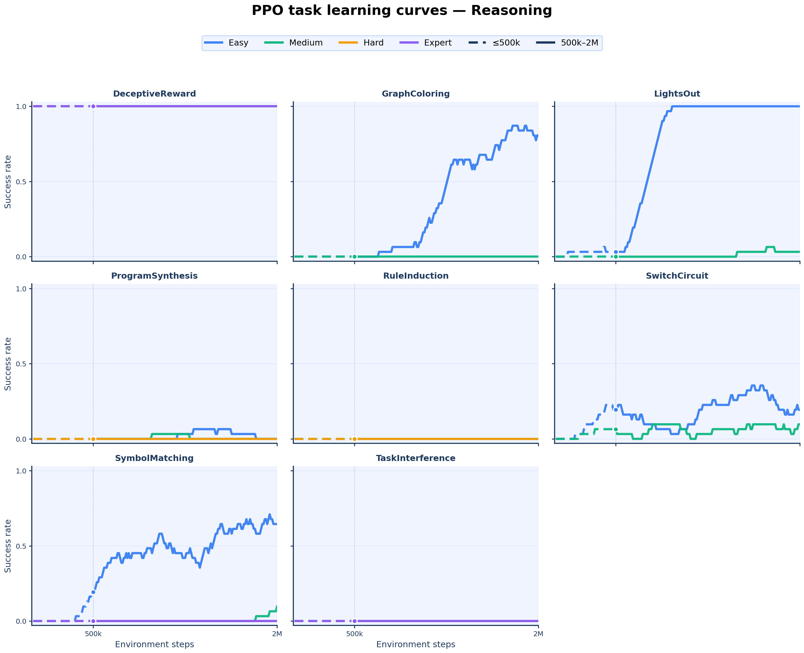
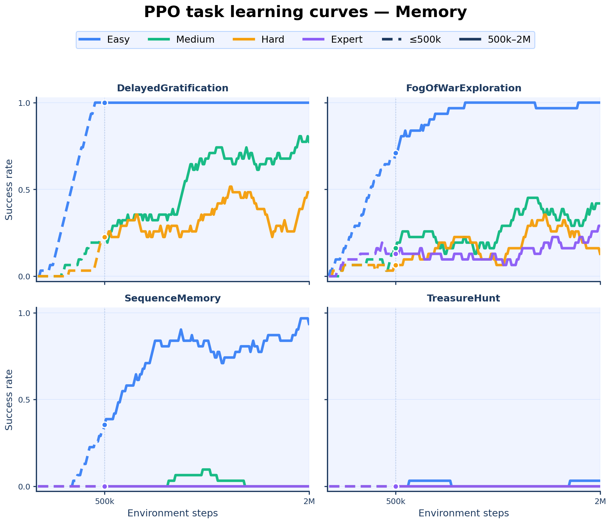
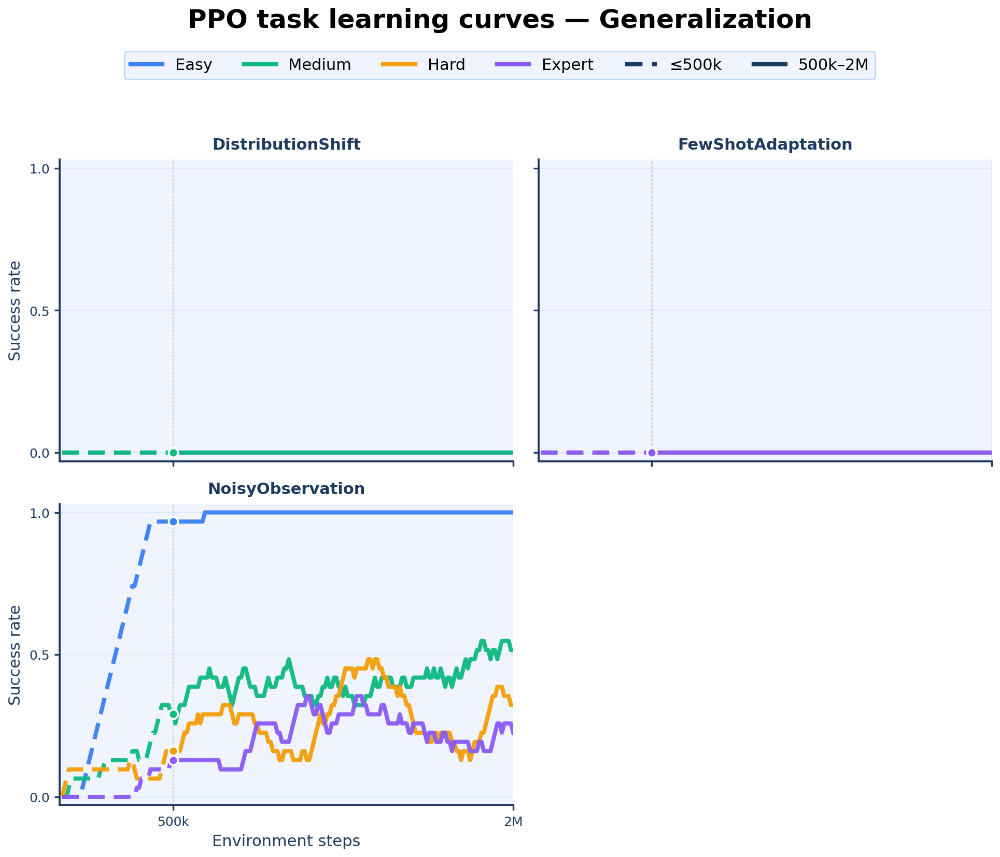
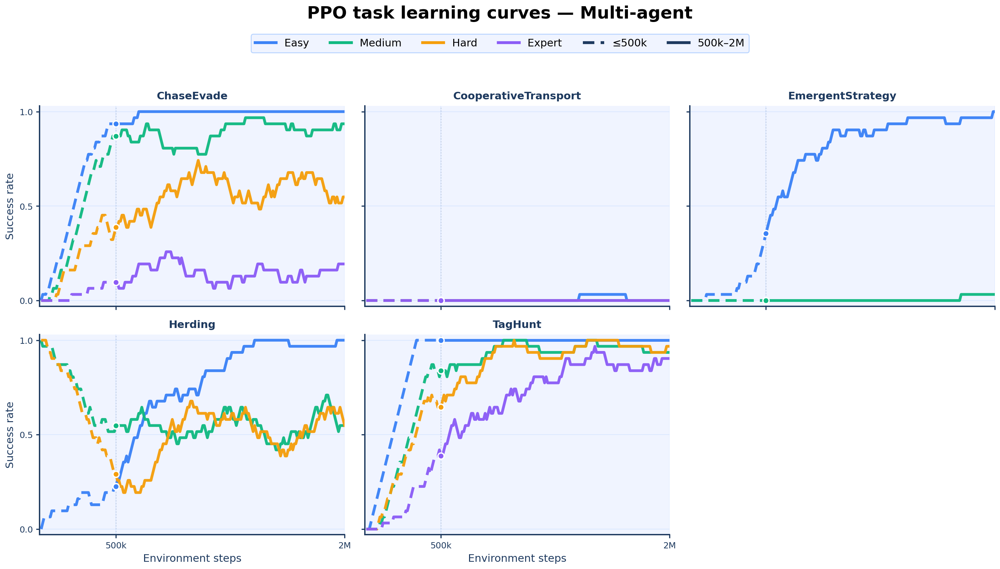

# Additional Training Results

This page reports additional supervised fine-tuning (SFT) results, difficulty
analysis, PPO training diagnostics, and a native VLM baseline for Agentick.
The figures and compact source tables are also collected in
`additional_results/` at the repository root.

## Qwen3.5-4B native VLM baseline

We evaluated the base, non-SFT Qwen3.5-4B model through its native vision
tower on Agentick's 512x512 synchronized pixel observations. We held the
Markovian direct-action harness, task descriptions, action space, sampling
configuration, and 25 official evaluation seeds per task-difficulty cell
fixed relative to the ASCII baseline.

| Agent | Observation | Easy | Medium | Hard | Expert | Overall |
|---|---|---:|---:|---:|---:|---:|
| Qwen3.5-4B, direct action | ASCII | .050 | .032 | .007 | .003 | .023 |
| Qwen3.5-4B, direct action | Pixels | .220 | .084 | .031 | .038 | .093 |

Difficulty columns are category-balanced across navigation, planning,
reasoning, memory, generalization, and multi-agent tasks. The pixel VLM's
category averages are .050, .147, .013, .135, .160, and .056, respectively;
its official overall score is .093 (95% CI: .046-.137). The full-precision
source tables are in `additional_results/qwen35_4b_vlm_summary.csv` and
`additional_results/qwen35_4b_vlm_category_summary.csv`.

## Supervised fine-tuning

We fine-tune Qwen3.5-4B with LoRA on examples pairing each state with the oracle
action. The 120k and 250k configurations use the same ASCII input and are
evaluated on the full benchmark, four difficulties, and 25 evaluation seeds per
task-difficulty pair as the corresponding base-model results.

| Prompting method | Base Qwen3.5-4B | SFT-120k | SFT-250k |
|---|---:|---:|---:|
| Direct action | 0.0232 | 0.3544 | **0.4466** |
| Reason before acting | 0.2280 | 0.3489 | **0.4436** |

## Difficulty scaling validation

Difficulty labels select parameter regimes of each seeded procedural generator;
they do not select hand-authored levels. Every seed generates a new instance,
while easy through expert jointly scale task-relevant axes such as grid size,
object or constraint count, stochasticity, and horizon. The axes and four
parameter presets are benchmark design choices.

The compact table reports overall mean success across the full benchmark and
25 official seeds per task-difficulty pair.

| Agent | Easy | Medium | Hard | Expert | Easy→Expert drop |
|---|---:|---:|---:|---:|---:|
| GPT-5 mini | .494 | .332 | .223 | .189 | 61.8% |
| PPO dense 2M | .606 | .277 | .160 | .104 | 82.8% |
| Qwen3.5-4B | .445 | .259 | .110 | .098 | 78.0% |
| SFT-250k | .647 | .467 | .369 | .303 | 53.1% |
| **Average across agents** | **.548** | **.334** | **.215** | **.173** | **68.3%** |

Every agent performs worse as difficulty increases. Averaged across the four
agents, success falls from .548 to .173 (68.3%).

## PPO learning curves

PPO is trained independently with one policy per task-difficulty pair rather
than as one multitask policy. The figures below show the 2M-step training
trajectories. Each subplot contains the easy, medium, hard, and expert policies
for one task. Color denotes difficulty. Every trajectory is continuous: the
line is solid from 500k to 2M steps and dashed before 500k, with a marker at the
500k checkpoint. The y-axis is the periodic evaluation success rate, smoothed
with a 31-point trailing rolling mean so the 500k marker uses no post-500k data.

| Checkpoint | Easy | Medium | Hard | Expert | Average | Gain since prior |
|---|---:|---:|---:|---:|---:|---:|
| 500k | .441 | .217 | .167 | .141 | .243 | — |
| 1M | .573 | .282 | .221 | .181 | .329 | +.086 |
| 1.5M | .656 | .313 | .243 | .209 | .377 | +.048 |
| 2M | .679 | .339 | .239 | .209 | .393 | +.016 |

The final column is the change in the overall average since the previous
checkpoint. It shrinks from +.086 to +.048 to +.016, making 1.5M→2M the
smallest improvement. The category-level figures show the plateau directly:
many easy runs are already saturated, while difficult runs are largely flat.
Each training curve evaluates the same fixed test episode at every checkpoint;
the final leaderboard evaluation instead averages 25 official seeds. The same
category figures are collected in the root-level `additional_results/`
directory.

### Navigation

### Planning

### Reasoning

### Memory

### Generalization

### Multi-agent

