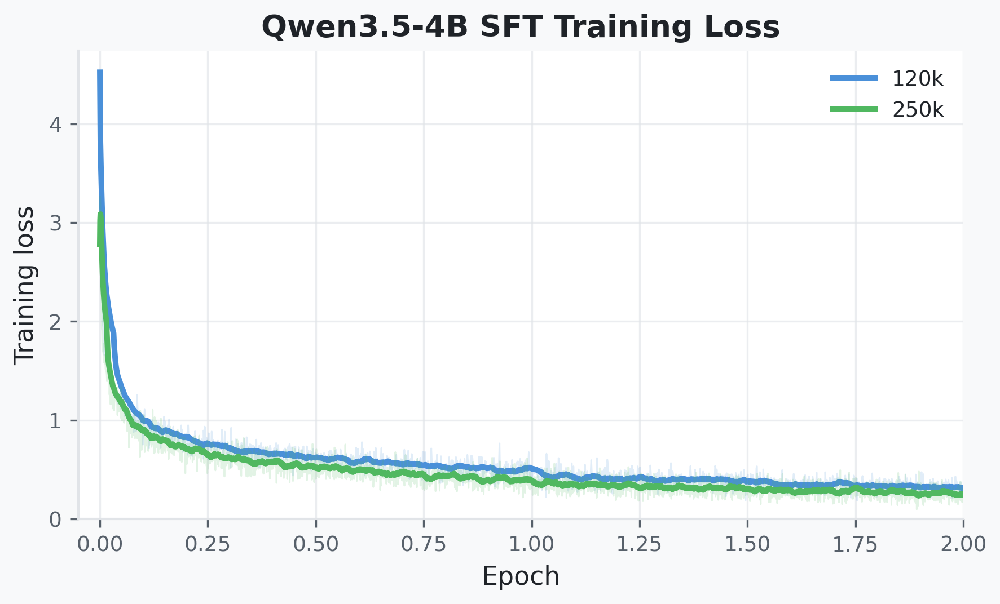
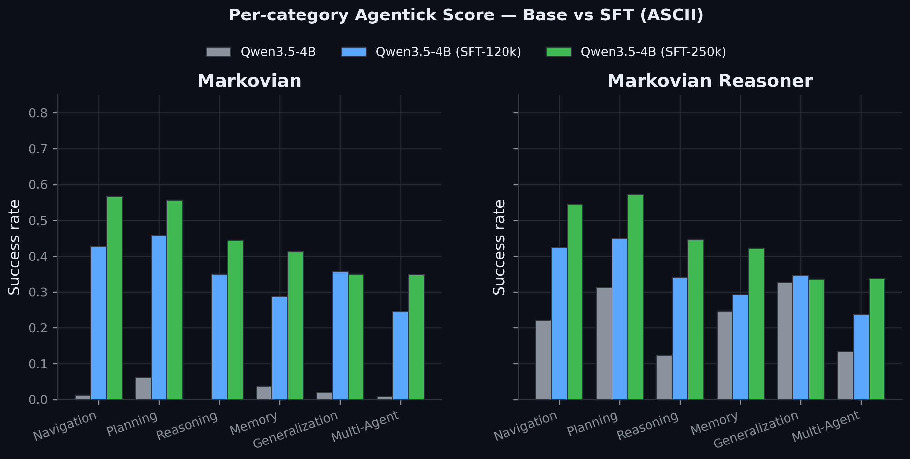

# Additional Training Results

This page reports additional supervised fine-tuning (SFT) results and PPO
training diagnostics for Agentick.

## Supervised fine-tuning

We LoRA-fine-tune Qwen3.5-4B on per-step state-action examples from the
Agentick oracle trajectory datasets. The 120k and 250k configurations use the
same ASCII observation interface and are evaluated on the same 37 tasks,
four difficulties, and 25 evaluation seeds per task-difficulty pair as the
corresponding base-model results.

| Harness | Base Qwen3.5-4B | SFT-120k | SFT-250k |
|---|---:|---:|---:|
| Markovian | 0.0232 | 0.3544 | **0.4466** |
| Markovian reasoner | 0.2280 | 0.3489 | **0.4436** |

## Difficulty scaling validation

Difficulty labels select parameter regimes of each seeded procedural generator;
they do not select hand-authored levels. Every seed generates a new instance,
while easy through expert jointly scale task-relevant axes such as grid size,
object or constraint count, stochasticity, and horizon. The axes and four
parameter presets are benchmark design choices.

The table reports mean success over all tasks in each category and 25 official
evaluation seeds per task-difficulty pair. Each cell is
easy/medium/hard/expert.

| Category | GPT-5 mini | PPO dense 2M | Qwen3.5-4B | SFT-250k |
|---|---:|---:|---:|---:|
| Navigation | .675/.520/.400/.230 | .600/.250/.090/.060 | .495/.295/.085/.015 | .785/.600/.495/.390 |
| Planning | .680/.351/.178/.129 | .876/.391/.227/.116 | .556/.436/.156/.107 | .836/.604/.462/.324 |
| Reasoning | .155/.135/.130/.105 | .365/.150/.125/.125 | .345/.100/.030/.020 | .595/.425/.400/.360 |
| Memory | .540/.400/.170/.280 | .670/.310/.080/.070 | .460/.240/.080/.210 | .560/.430/.290/.370 |
| Generalization | .547/.440/.387/.373 | .333/.187/.080/.053 | .413/.373/.293/.227 | .467/.320/.333/.280 |
| Multi-agent | .368/.144/.072/.016 | .792/.376/.360/.200 | .400/.112/.016/.008 | .640/.424/.232/.096 |
| **Overall** | **.494/.332/.223/.189** | **.606/.277/.160/.104** | **.445/.259/.110/.098** | **.647/.467/.369/.303** |

All four overall sequences decrease strictly from easy to expert; 20/24
agent-category sequences are monotone. The four local reversals are small-sample
category effects rather than a failure of the overall ordering.

## PPO learning curves

PPO is trained independently for every task-difficulty pair: the benchmark
contains 148 separate policies rather than one multitask policy. The figures
below show the complete 2M-step trajectory for every available policy. Each
subplot contains the easy, medium, hard, and expert policies for one task.
Color denotes difficulty. Every trajectory is continuous: the line is solid
from 500k to 2M steps and dashed before 500k, with a marker at the 500k
checkpoint. The y-axis is the periodic evaluation success rate, smoothed with
a 31-point trailing rolling mean so the 500k marker uses no post-500k data.

Across the 37 task-level aggregates, the median absolute change between the
1.2M–1.6M and 1.6M–2M windows is 0.0125 success-rate units (mean 0.0221);
32/37 are within 0.05 and 36/37 are within 0.10. The periodic points are
deterministic diagnostic episodes; final leaderboard evaluation uses all
25 official evaluation seeds.

### Navigation

### Planning

### Reasoning

### Memory

### Generalization

### Multi-agent

